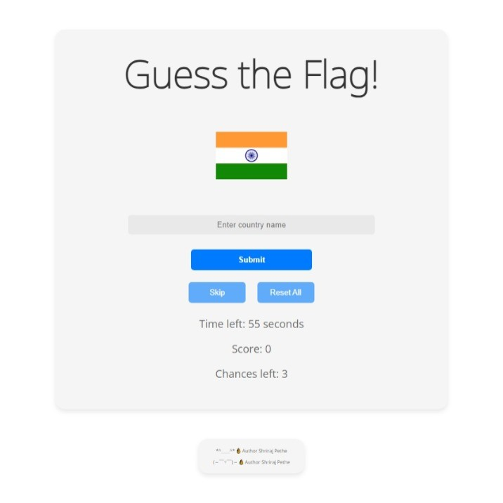

# FlagFiesta

 

## Description

FlagFiesta is an engaging web-based game that challenges players to identify flags from around the world within a set time frame. Not only is it a fun way to test your flag knowledge, but it's also a great way to learn and familiarize yourself with the many flags from different countries.

We source our flags from this list: [Gallery of sovereign state flags (wikipedia)](https://en.wikipedia.org/wiki/Gallery_of_sovereign_state_flags). Only the recognized sovereign state flags are incorporated. Note that we're still under development, and constructive criticism is always welcome.

## Features

- **Randomized Flags**: Never play the same game twice! Flags are randomized each round.
- **Timed Challenge**: Race against the clock to maximize your score.
- **Score Tracker**: Keep tabs on your score and try to beat your personal best.
<!-- - **Interactive UI**: Responsive design ensures a seamless gameplay experience on all devices. -->

## How to Play

1. **Start the Game**: Load the game and you'll be presented with a random flag.
2. **Guess**: Type in your guess in the provided input box.
3. **Submit**: Click the "Submit" button to check your answer.
4. **Skip**: Not sure about a flag? Hit "Skip" to move to the next one, but watch out, it'll cost you a chance!
5. **Timer**: Keep an eye on the timer. Once it reaches zero, the game ends.
6. **Score**: Correct guesses add to your score. Aim high and challenge your friends!

## Development

FlagFiesta is crafted using vanilla JavaScript, HTML, and CSS. This front-end-only project is designed for lightweight operation and wide-ranging browser compatibility.

## Feedback and Contribution

Your feedback and suggestions are invaluable. If you're interested in contributing, please open a pull request. Every contribution is appreciated! We encourage feedback or further enhancements to this project. Kindly verify the accuracy of flags and their corresponding countries.

<!-- ## License

MIT -->

*^____^* 👌      Author Shriraj Pethe
(～￣▽￣)～ 👌      Author Shriraj Pethe